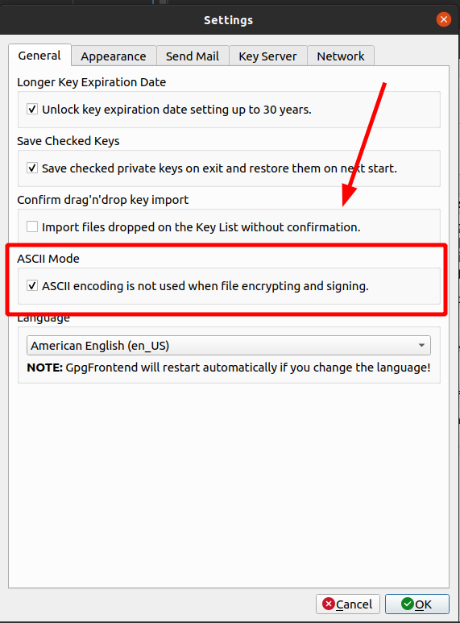
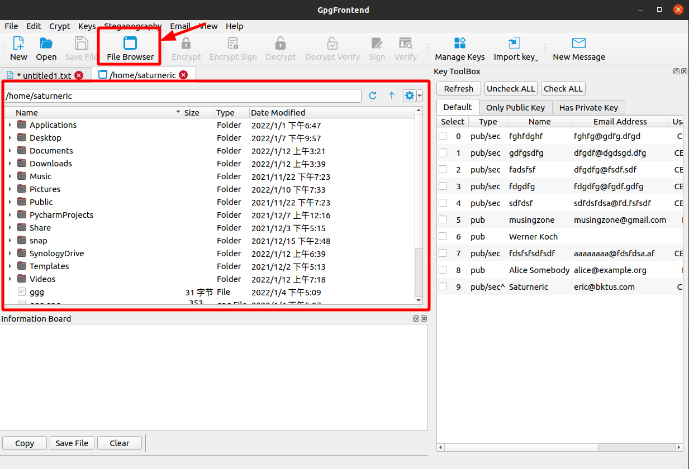
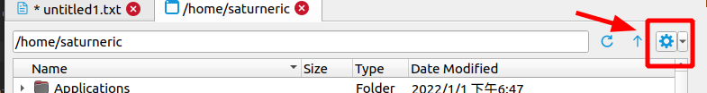
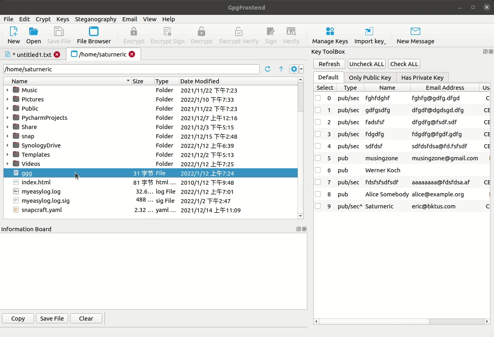
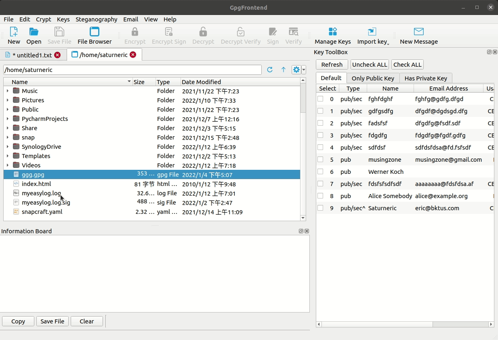

# Encrypt & Sign File

Gpg Frontend provides a convenient and fast way to operate on files. The concept of encryption and decryption files is
almost the same as text, except that the input and output of file operations can be binary.

## File Extension Introduction

For ciphertext in ASCII format, its filename suffix is usually asc, and you can directly open such files with a text
editor. However, if the ciphertext is binary, its file extension will be gpg. Usually, binary ciphertext files are
smaller than ASCII format.

Before v2.0.4, the ciphertext files generated by GpgFrontend are all in ASCII format. But starting from v2.0.4,
GpgFrontend will generate ciphertext files in binary format by default. you can change this setting in settings.

## File Browser

In the top menu file option, you can open the file browser(Ctrl/Command + B). Then by using the file browser, first
enter your working directory. Then right-click the file you need to operate, and then select the operation you want in
the pop-up menu.

There are two control buttons at the top of the file tab. The one on the left is the up level, and the one on the right
is to enter or refresh the corresponding path in the input box on the left.

On the far right is a button with useful options that you can tick to show system files or hidden files.

### Encrypt & Sign

This method provides encryption and signature functions, which GpgFrontend recommend, so that the receiver can know that
the ciphertext comes from you. You can select one or more recipients' public key and your own private key to complete
this operation.

This operation generates a file with the gpg extension. The file with this suffix contains both encrypted content and
signed content.

### Decrypt & Verify

This ciphertext is verified while decrypting, which can improve security. In addition, you can also perform Only Verify
operations and this operation will verify without decryption. To use this operation, you need to select a file with a
gpg or asc extension, which contains the ciphertext and signature content.

In order to encourage users to check whether the ciphertext is signed or not when decrypting, Gpg Frontend does not
provide a separate decryption operation here.

