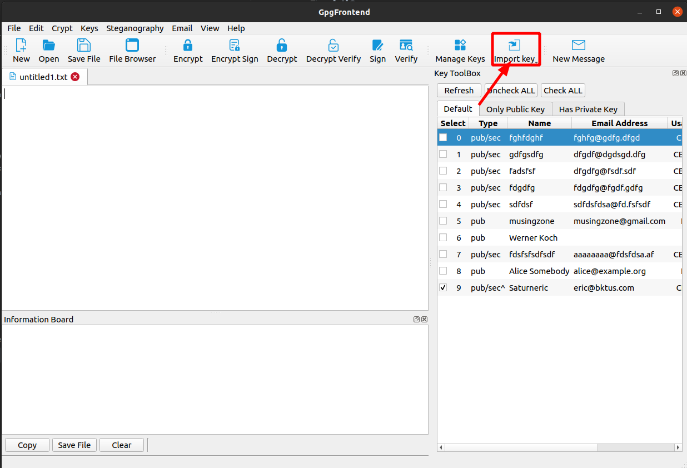
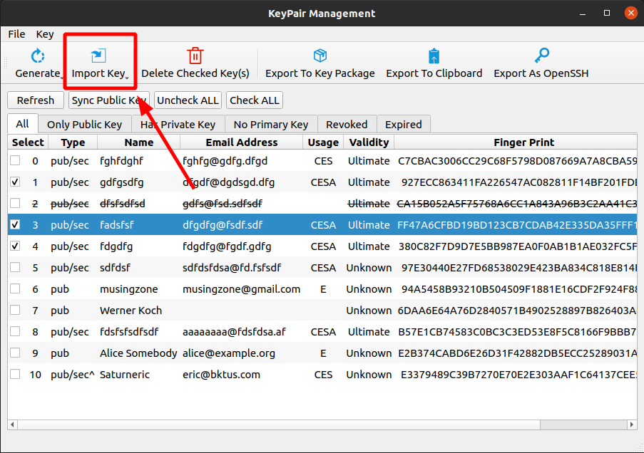
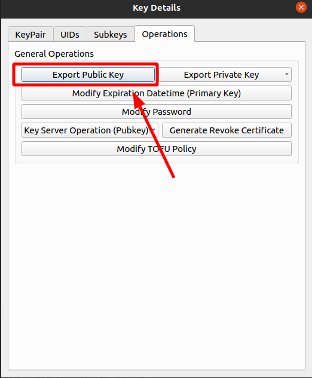
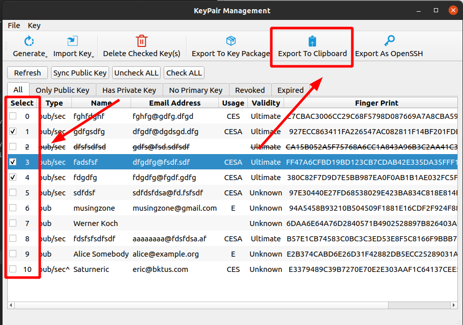
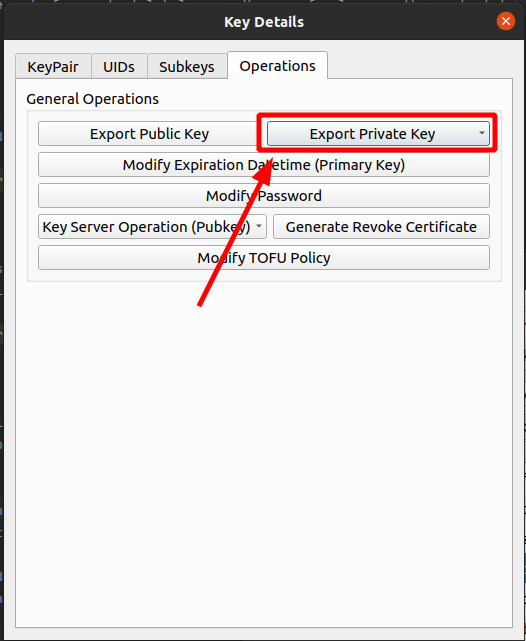

# Import & Export Key Pair

GpgFrontend provides multiple ways for users to import or export key paris. Here we will introduce some classic
operations. Read the guide.

## Import Key Pair

You can find the import options in the toolbar. You can choose several import methods according to your actual
situation. Let’s introduce these methods.

In fact, you can find this action menu in key management, and here you can do more actions.

### File

When you select this option, you need to select a public key or private key file that meets the standard. The file you
choose should be in text format, with any extension.

### Editor

You can paste the contents of the key file on a blank text label page. Then click this option, GpgFrontend will
automatically recognize and import the corresponding key.

### Clipboard

You can copy the contents of the key to your system clipboard somewhere else. Then, after selecting this option, the
corresponding key will be imported.

### Keyserver

After selecting this option, you can enter the email or ID corresponding to the key in the pop-up selection, and then
select the appropriate key server. Then after clicking the search button, GpgFrontend will list the public keys that can
be imported in the key server. You can import them together, or you can choose to double-click the table row to import
the corresponding public key. Note: The keys imported in this way are all public keys.

A detailed description of this part can be found [Here](./key-server-operations.md).

### Dropdown on Key Toolbox

You can drag the key file directly to the key toolbox, and then follow the prompts of GpgFrontend to import the key.

## Export Key Pair

Deriving the public key of a key pair with the private key means deriving either the public key or the private key or
both of all the keys present in the key pair. If there are very many keys in the key pair, the exported data will be
very long. Similar to import, there are multiple export methods.

For Gpg Frontend, the exported data is encoded in ASCII, which ensures data compatibility between computers.

### Export Public Key

you can find this operation in many places.The following will introduce them one by one.

#### Append Public Key to Editor

Right-click a row in the key toolbox, and click Append Select Key(s) to Editor in the pop-up menu item. You will find
that the public key that the key is right appears at the end of your text label page. You can freely copy the content to
any place.

#### Export on the Key Pair at Operations Tab

You can do this as shown in the screenshot below, which will store the data to a file. Please select a suitable
directory to store this file containing the public key data before going anywhere.

### Export multiple public keys at once

You can export all public key data in multiple key pairs at one time, and you can select the key pairs you want to
export on the key management interface. Then, you can click Export to Clipboard.

### Export Private Key

You can find private key options everywhere in the detail's page that contains the private key (primary key or subkey).
Then you can select a location, and GpgFrontend will export the corresponding private key content to that location
later.

Exporting the private key also exports the public key and private key data, because the private key data without the
public key is meaningless by itself, you cannot deduce the public key from the private key.

Generally speaking, the private key content will be bundled with the public key content to export and export. Please
note: the private key file can never be disclosed to others. If it is leaked, it means that all ciphertexts encrypted by
the key are no longer safe.

You can export the private key data in your key pair in two ways.

1. Full export: Include all key data and UID and UID signature in the key pair.
2. Minimal export: Only all key data in the key pair is included.

### Securely export and transfer as a Key Package

You can package the private key data or public key data of multiple key pairs into a Key Package to allow them to be
securely transferred between your PC devices. This part of the function will be introduced in the feature.