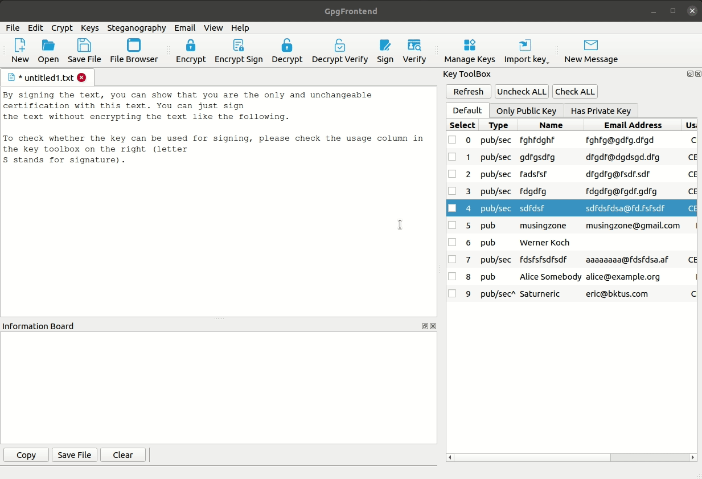
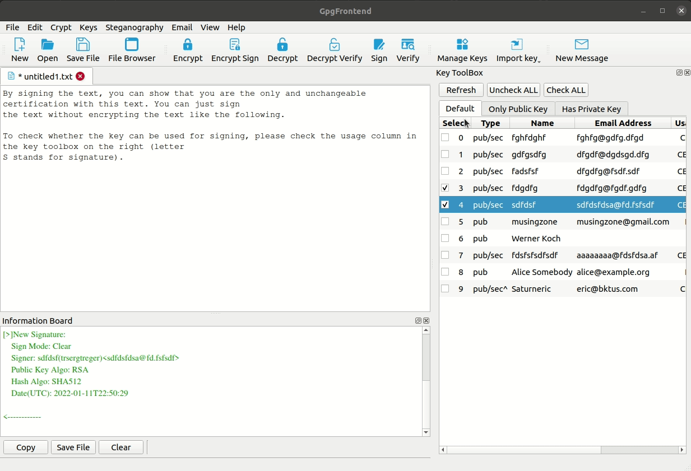
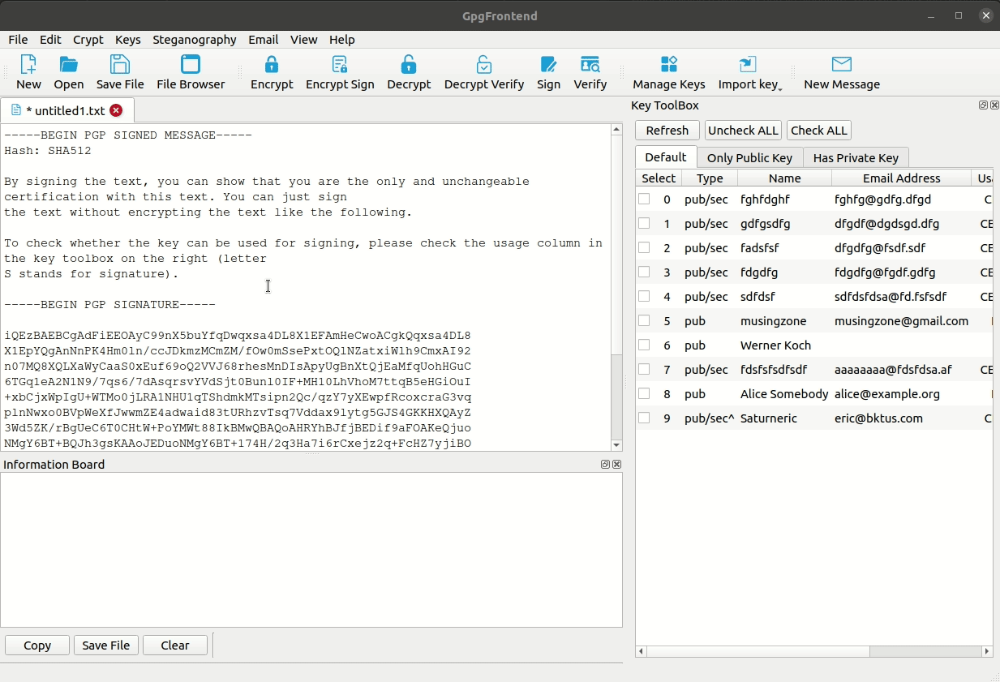
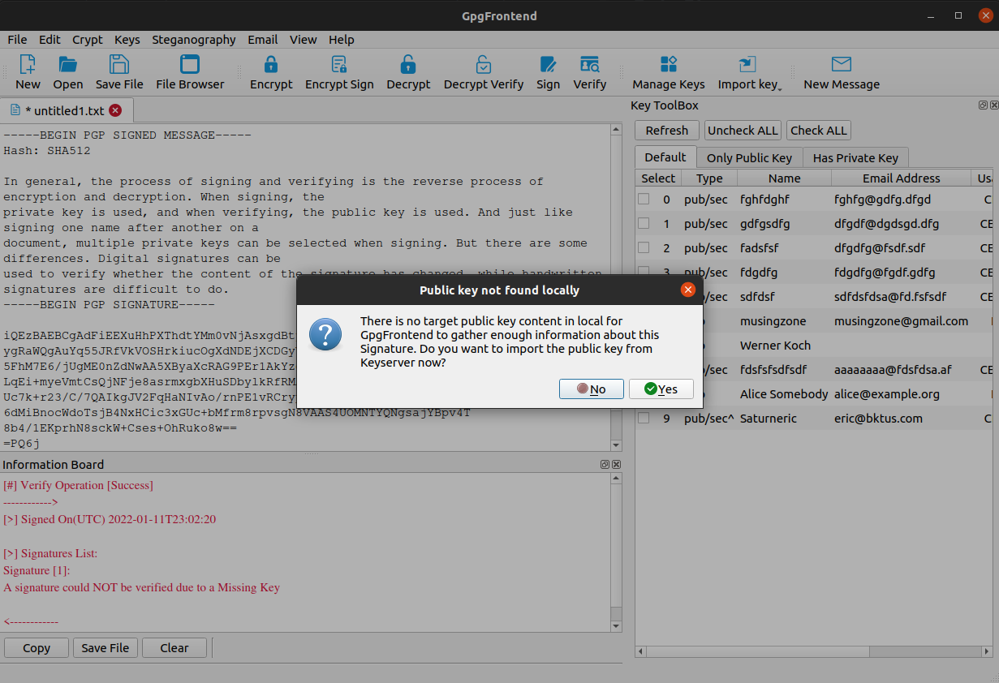
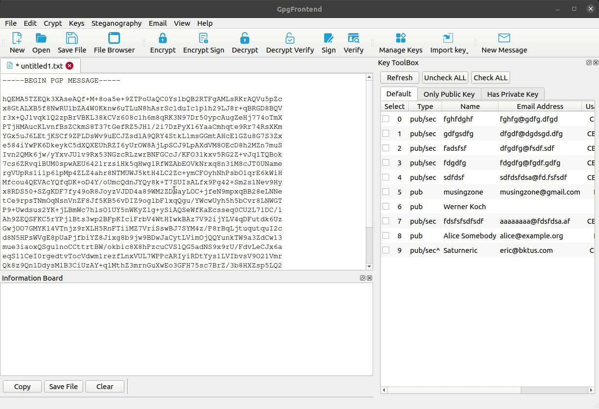

# Sign & Verify Text

In general, the process of signing and verifying is the reverse process of encryption and decryption. When signing, the
private key is used, and when verifying, the public key is used. And just like signing one name after another on a
document, multiple private keys can be selected when signing. But there are some differences. Digital signatures can be
used to verify whether the content of the signature has changed, while handwritten signatures are difficult to do.

## Only Sign

By signing the text, you can show that you are the only and unchangeable certification with this text. You can just sign
the text without encrypting the text like the following.

To check whether the key can be used for signing, please check the usage column in the key toolbox on the right (letter
S stands for signature).

## Sign With Encrypt

You can also encrypt this short text while signing, which is equivalent to signing while encrypting. A typical usage
method is to check two key pairs, one is someone else's public key, which is used for encryption; the other is your own
private key, which is used for signing. If you do not check any key that can be used for signing, this is possible (
equivalent to encryption only). The only difference is that you will receive a warning.

## Verify

After obtaining a plaintext and its signature, you can verify the signature. Please keep in mind that this form of
signature is not suitable for use in emails as it will make the email less readable, if you need to sign your email,
please use the "New Message" function to generate the OpenPGP/MIME format sign for your email.

To verify a signature with text, you need to have the corresponding public key for all included signatures. If a
suitable public key for a signature is not found locally during verification, Gpg Frontend will remind you to import it.

## Verify With Decrypt

After obtaining a ciphertext, you can try to verify it while decrypting it. This is a good habit regardless of whether
the encryptor has signed in advance. Because you cannot infer from the format of the ciphertext whether it has been
signed or not. So, use decryption operations with verification whenever possible.

