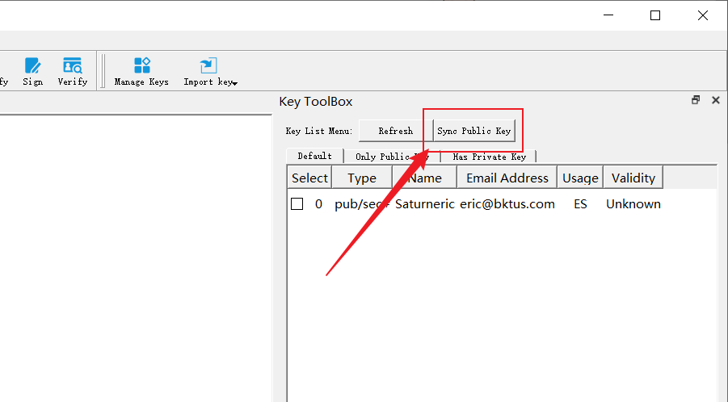
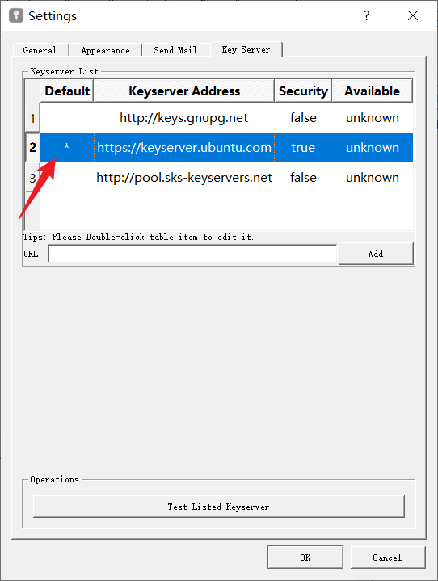

# Public Key Sync

Sometimes, you need to keep your local key consistent with the one on the key server. This is critical in cases where a key owner revokes its key, at which point you need to stop using the key immediately. This avoids potential man-in-the-middle attacks. Or, if the key owner creates a new subkey for signing, gpg will not be able to verify the validity of the ciphertext if the ciphertext he sends to you signs with the subkey and you do not have local information about the subkey.

## How to use

It's very simple, after clicking the Sync Public Key button in the Key ToolBox or the Key Management interface on the homepage, things will be done automatically.

This feature will check all the public keys you now have (only the public key, not any private keys) and then search for it in the key server. If the corresponding public key is found in the key server, GpgFrontend will import the latest public key from the key server to the local.

### Key server

How do I know which key server GpgFrontend accessed? It's simple, GpgFrontned will exchange keys using the default key server you set up. If you need to change the key server you need to access, you just need to add your key server in the settings and set it as the default.

