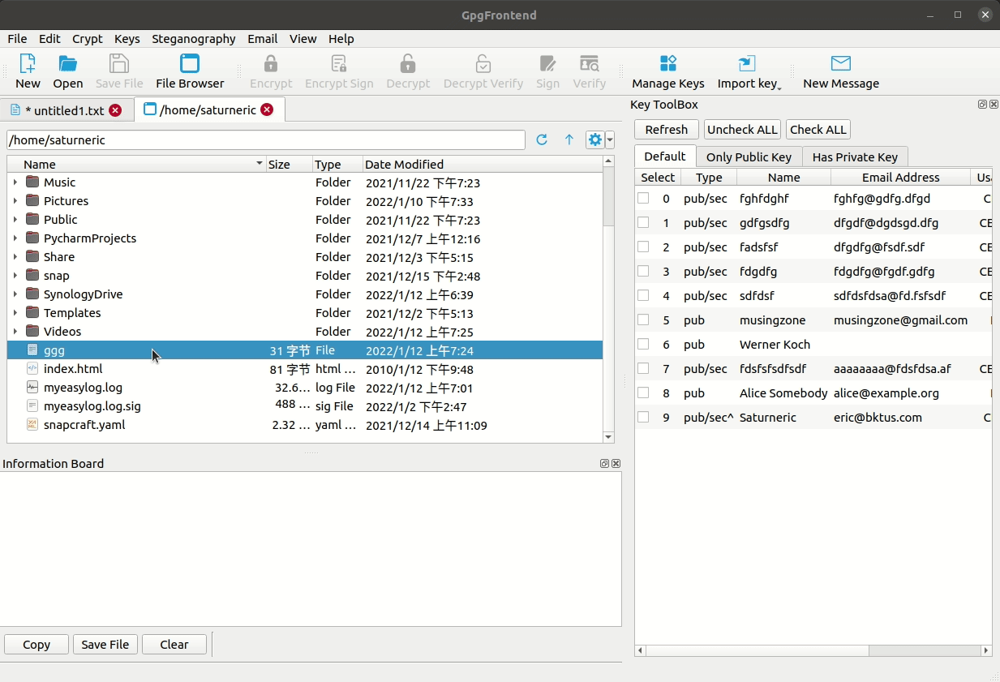

# Encrypt & Sign File

GpgFrontend offers a fast and convenient method for working with files. The
encryption and decryption process for files is nearly identical to that of text,
with the exception that file operations involve binary input and output.

## File Extension Introduction

For ciphertext in ASCII format, the file extension is typically "asc" and these
files can be opened with a text editor. On the other hand, if the ciphertext is
in binary format, the file extension will be "gpg". Binary ciphertext files are
generally smaller than ASCII format.

Before version 2.0.4, GpgFrontend generated ciphertext files exclusively in
ASCII format. However, beginning with version 2.0.4, GpgFrontend now generates
ciphertext files in binary format by default. This setting can be adjusted in
the program's settings.

## File Browser

From the top menu's "File" option, you can access the file browser by pressing
Ctrl/Command + B. By using the file browser, you can navigate to your working
directory and right-click on the file you wish to work with. This will open a
pop-up menu, where you can select the operation you want to perform on the file.

Located at the top of the file tab are two control buttons. The button on the
left allows you to navigate up one level in the directory hierarchy, while the
button on the right refreshes the input box on the left with the corresponding
path.

On the far right of the file tab, there is a button with useful options that you
can select to show system files or hidden files.

### Encrypt & Sign

GpgFrontend recommends using the encryption and signature functions in this
method, so that the recipient can verify that the ciphertext originates from
you. You can select one or more recipients' public keys as well as your own
private key to complete this operation.

When the operation is complete, a file with the ".gpg" extension is generated.
This file contains both encrypted content and signed content.

### Decrypt & Verify

When decrypting this ciphertext, it undergoes verification, which enhances
security. Additionally, you can perform a "Only Verify" operation which verifies
the content without decrypting it. To use this operation, you must select a file
with a ".gpg" or ".asc" extension, which contains the ciphertext and signature
content.

To encourage users to verify whether the ciphertext is signed or not when
decrypting, Gpg Frontend does not provide a separate decryption operation for
this.

