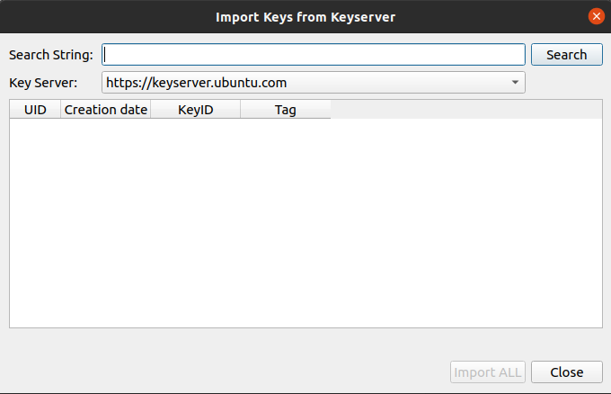
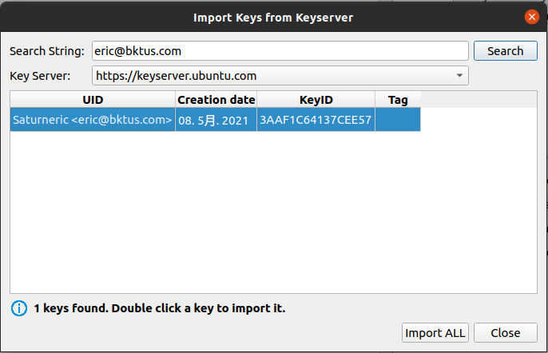
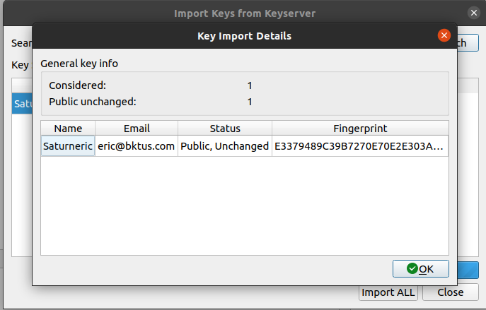
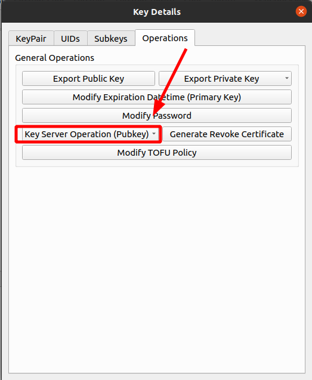
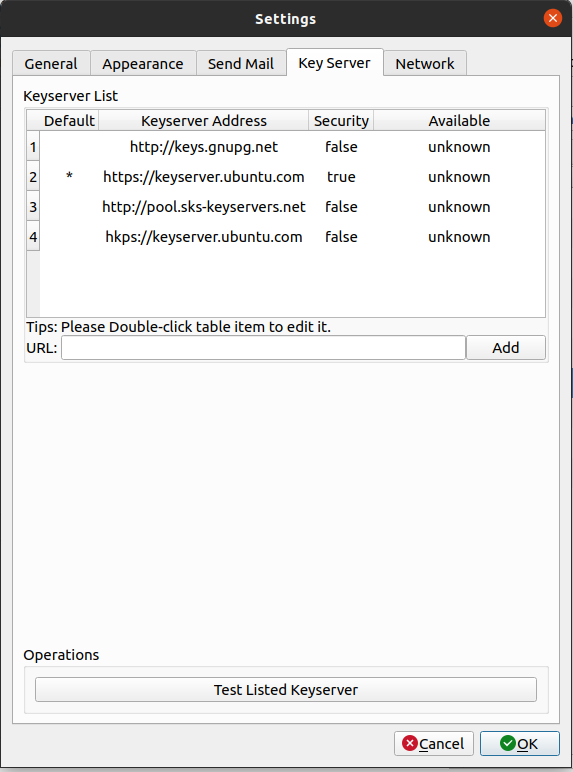

# Key Server Operations

There are certain scenarios where you require encrypted communication but only
have the recipient's email address and do not possess the recipient's public
key. Additionally, in the event that your key has been inadvertently exposed, it
becomes necessary to notify the holders of your public key to discontinue its
use for sending encrypted information. In such cases, the key server can be
utilized to facilitate key information sharing. You can upload your public key
information to the key server, or search and retrieve the required public key
using email addresses or key IDs.

Upon uploading your public key information to the key server, it is transmitted
across key servers globally, making it accessible to individuals worldwide.
GpgFrontend features key server interaction capabilities, which enable users to
rapidly share their public key, search for and import required public keys using
mouse operations. It is essential to note that once public key information is
uploaded to the key server, it cannot be deleted and will be retained
indefinitely. However, the public key of the old key pair can be overwritten by
updating when a subkey is added to the key pair.

## Import Public Key From Key Server

In the main page or in the key manager's Import key operation mode, there is a
key server option. After selecting this option you can see such an interface.

You can get a list of public keys associated with a key server by searching for
Key ID, fingerprint or email address via the search box. If there is a suitable
public key in the list, you can import it by double-clicking it.

When the import is complete, you can check whether the public key is actually
imported through the pop-up window (no need to import when the local public key
is newer), and you can also check some brief information about the public key.

It is important to note that the public key you import may have expired or been
revoked. You can check the status of the key by navigating to the category tab
in the key management interface. In addition to the search box, you may also
notice a drop-down box that allows you to choose which key server to retrieve
the public key information from. To modify or add to this list of candidate
servers, please refer to the last section of this document: Key server related
settings.

## Export My Public Key To The Keyserver

If the current key pair has a master key, you have the option to publish the
public key information to a key server. It is important to note that in order to
avoid confusion, GpgFrontend requires the presence of a master key for this
action to be performed. This ensures that users are aware of what they are doing
and the function being performed.

### How To Use

You can find the entry of this operation through the operation tab of the key
pair detail interface, as shown in the following figure.

Perform the operation by clicking Upload key pair to key server. Note that the
naming of operations here is a bit confusing, but this is where your public key
information (not your private key) will be uploaded.

### Synchronize public key information from a key server

Sometimes, before you perform an encryption operation, you want to know if the
public key you are using is still valid. At this point, you can get the latest
information about the key from the key server (if the public key server has
one).

As above, you can find this action in the Actions tab of the key pair details
screen, as shown in the image below.

### Extra Information

Gpg Frontend will upload the public key information to the default key server
you set. The private key information is not uploaded and should not be manually
uploaded anywhere by the user.

Refer to the last section of this document on how to set the default key server.

The "Synchronize key pair with key server" function allows for automatic
retrieval of public key information from the key server, which is then compared
with the local key information. After the operation is completed, a pop-up
window will appear indicating whether the key has actually been updated. It
should be noted that this operation is not possible if the private key exists
locally. This is because, in such a case, you already have the key pair and
should publish the latest information for the key pair instead of accepting
outdated information from the key server.

### Extra Information

GpgFrontend automatically communicates with the default key server that you have
set to obtain the necessary information. You can refer to the last section of
this document to learn how to set the default key server.

## Sync ALL Public Key

This is an advanced function provided by GpgFrontend, it can synchronize all
your local public key information at one time, if you want to know, please read
[this document](../features/sync-all-public-keys.md).

## Key Server Related Settings

If you want to set a list of key servers or a default key server, you can do so
by accessing the Settings interface and navigating to the Key Servers tab. Here,
you will find options for managing your key server candidate list and
determining which key server is set as the default.

To add a candidate key server to the list, simply enter the http or https
address of the key server you wish to add into the input box and click "Add". It
is strongly recommended that users use the https protocol to prevent
man-in-the-middle attacks. If you wish to delete a candidate key server, simply
right-click on the corresponding row in the table and select "Delete" from the
pop-up menu. To edit an existing candidate key server address, double-click on
the address in the table and edit it.

To test the network connectivity of the servers in the key server candidate
list, click the "Test" button located at the bottom of the Key Servers tab.
However, note that the test only determines if the keyserver is reachable, not
whether the address is a valid keyserver.

### Set Default Key Server

To set a candidate key server as your default key server, you can follow these
steps. First, locate the candidate key server you want to set as the default in
the table. Then, right-click the row of the corresponding key server, and click
"Set as Default" in the pop-up menu. Once set, you can verify whether a
candidate key server is the default key server by checking the first column of
the table.