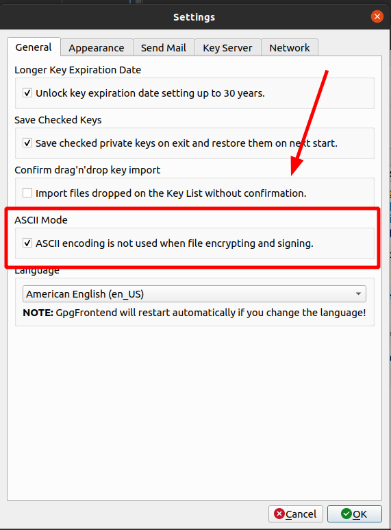
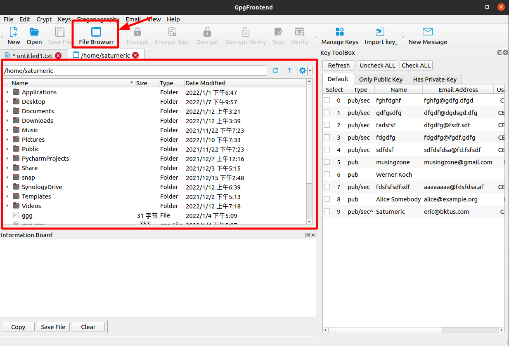
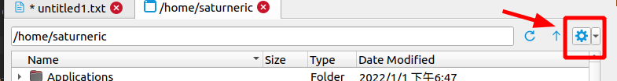
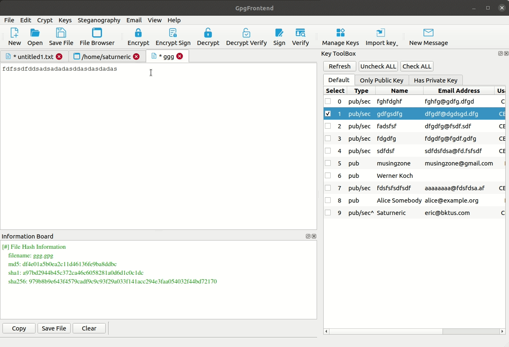

# Sign & Verify File

Gpg Frontend provides a convenient and fast way to operate on files. The concept
of signing and verifying files is almost the same as text, except that the input
and output of file operations can be binary.

## File Extension Introduction

For ciphertext in ASCII format, its filename suffix is usually asc, and you can
directly open such files with a text editor. However, if the ciphertext is
binary, its file extension will be sig or gpg. Usually, binary ciphertext files
are smaller than ASCII format.

Before v2.0.4, the ciphertext files generated by GpgFrontend are all in ASCII
format. But starting from v2.0.4, GpgFrontend will generate ciphertext files in
binary format by default. you can change this setting in settings.

## File Browser

In the top menu file option, you can open the file browser(Ctrl/Command + B).
Then by using the file browser, first enter your working directory. Then
right-click the file you need to operate, and then select the operation you want
in the pop-up menu.

There are two control buttons at the top of the file tab. The one on the left is
the up level, and the one on the right is to enter or refresh the corresponding
path in the input box on the left.

On the far right is a button with useful options that you can tick to show
system files or hidden files.

### Sign

Through the right-click menu, you can quickly sign a file. This operation will
generate a file with a sig or asc suffix, which contains the signature content.
In this case, you need to pass this file along with the original file so that
the other party can verify it.

### Verify

This operation needs to select a file with a gpg suffix (maybe invalid for the
ciphertext of a binary file) or a file with a sig suffix for verification.

When selecting a file with the sig suffix, make sure that the source file is
also in this directory. This means that the name of the source file is just
missing a sig suffix.

