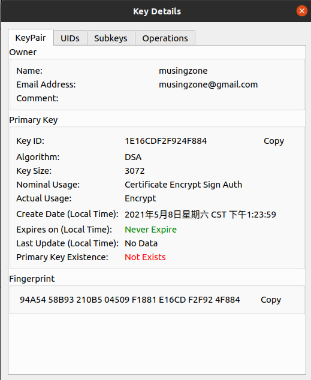
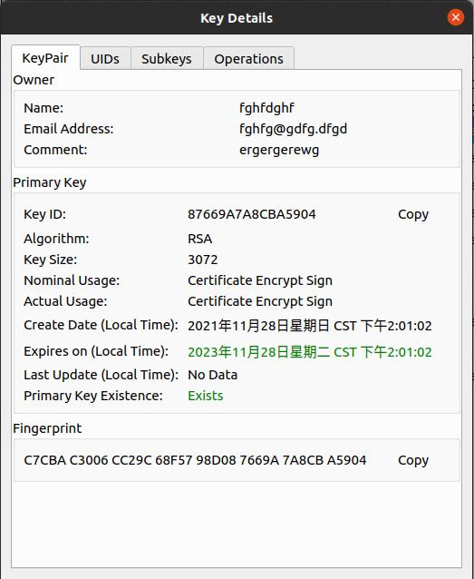
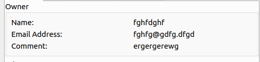
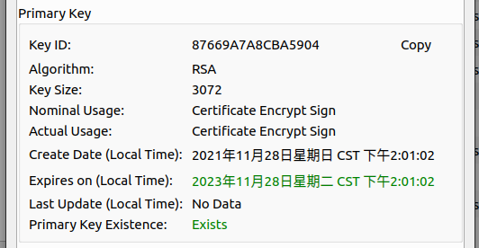
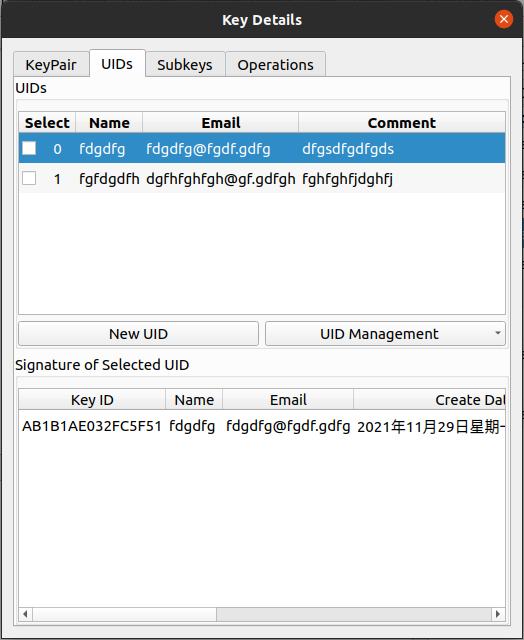
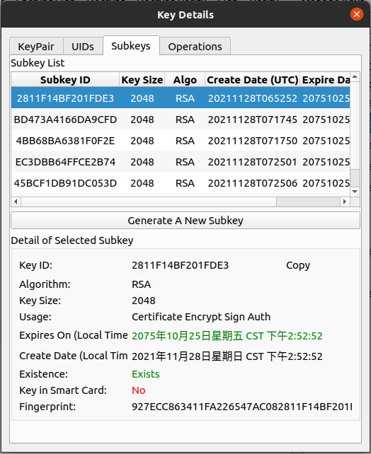
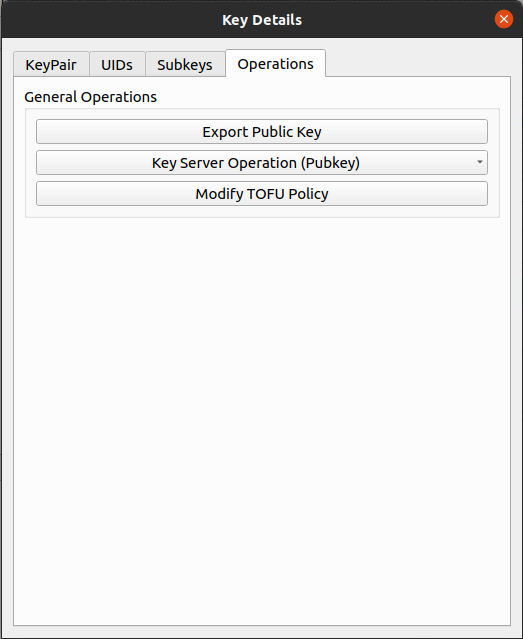
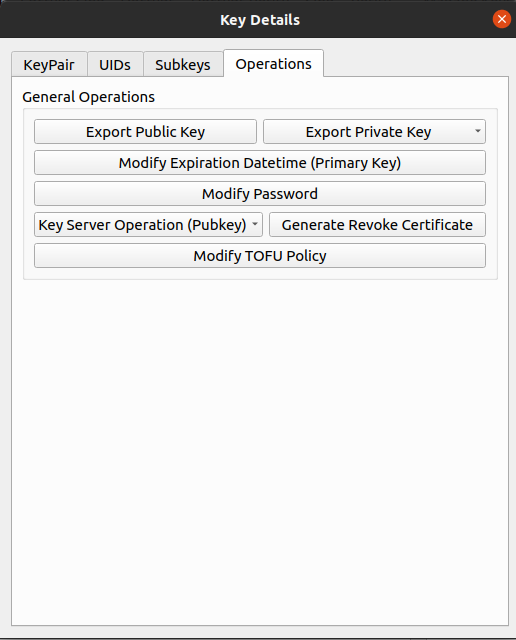

# View Key Pair Details

Right-click the key pair in the key toolbox or key management interface and
click Show key details to view the information about the key pair.

This part may involve a brief introduction to gpg-related concepts, and it will
be relatively long.

The screenshot below is my friend's public key that I got from the key server.

Below is a private key I randomly generated. You can find that the biggest
difference between him and the above is that the key pair with only the public
key is only used for encryption, and if you have the private key, you can do
more things (it also depends on your algorithm, DSA can only for signature).

## General Info

This interface provides some useful information to assist you in proper
management of the key pair.

### Owner

Through this section, you can understand the owner of this key pair. This
information is not fixed and unchangeable. You can create a new UID in the UID
section and set it as the main UID to change it.

According to the OpenPGP protocol, this part is divided into Name, Email, and
Comment.

### Primary key

This part is the information of the primary key of the key pair. The primary key
is very important, because without it, the key pair cannot perform related
management operations such as adding and revoking sub-keys (similar to the key
ring cannot be opened). Let's introduce the information of the primary key
separately below. If you want to learn more, see the [Basic
Concepts](../basic-concepts.md) section.

The absence of the master key means that the private key of the master key does
not exist, but neither the public key nor the private key exists. Please
remember: Each subkey and primary key consists of a pair of public and private
keys.

#### Key ID

The unique identifier of the key is fixed and unchanging. Note that this key ID
is the key ID of the primary key. The key ID is uniquely determined after the
key is generated. Compared with the fingerprint, the key ID will be shorter and
more user-friendly.

#### Algorithm

Algorithm used for key generation. Note that this also refers to the generation
algorithm of the primary key. The generation algorithm determines the properties
and capabilities of the key. Algorithms such as RSA can be used for encryption
and signature, but DSA can only be used for signature, but the DSA key length
can be shorter.

#### Key Size

The length of the primary key. It can be said that the longer the key, the
harder it is to crack the ciphertext, but at the same time, the more time it
takes for a single operation. Generally speaking, a length of 2048 bits is safe
enough ( This refers to the key generated using the RSA algorithm).

#### Normal Usage

What can the key pair conceptually be used for (including the conceptual usage
of the primary key and sub-key). When the primary key or subkey generation can
be used to sign, but it has already expired or does not exist, the signature
usage will still be displayed here.

#### Actual Usage

The actual usage of the primary key and all subkeys. It is the union of their
usage. If there is only one primary key in the key pair that can be used for
signing, but this primary key does not exist. Then the signature usage will not
appear here, only in Normal Usage. In addition, when there is only one subkey
that can be used for signing, if it has expired, the signature purpose will not
be displayed here.

#### Expires on

The expiration time of the primary key. When the primary key expires, it will be
invalid. You cannot use it for any operation. In addition, the subkeys in the
key pair will also be unavailable. Fortunately, you can change the expiration
time of the primary key at any time, or even set it to never expire. The
prerequisite for this is that the primary key exists in the key pair.

#### Last Update

The time when the content of the key pair was last updated. Operations such as
adding a UID or subkey will modify the content of the key pair.

#### Secret Key Existence

Shows whether the actual content of the primary key exists. When the primary key
does not exist, if there are still available subkeys in the key pair, the key
pair can still be used for normal operations. However, in the above case, the
content of the key pair cannot be modified (that is, operations such as adding
UID or subkey cannot be performed), and the key pair cannot sign other key
pairs.

### Fingerprint

The fingerprint of the key pair is used for humans to quickly compare whether
the key pair is the expected key pair. This field is unique for all keys in the
world. You can absolutely do this with the key ID mentioned above.

This also refers to the fingerprint of the primary key.

## UID Info

UID stands for User ID, and it is a mechanism used to identify a key, primarily
for the purpose of human identification. It can be compared to a name tag that
accompanies a key ring, indicating who the key ring belongs to. By looking at
the UID, humans can get a rough idea of whether a key pair is what they
expected, but for accurate identification, fingerprints or key IDs need to be
compared. A key can have one or more UIDs, while a key pair can have only one
primary UID.

The primary UID is always listed first in the interface.

UID has three elements, Name, Email, Comment. The name must be greater than or
equal to five characters, and the email must conform to the format. Comment
rules are relatively loose.

### Signature of UID

The lower section of the interface displays the signature of the User ID (UID)
that was selected from the list of UIDs, not the one that was checked in the
box.

This is a key trust system. When someone receives your public key, they obtain a
copy of your key ring with only your public key and nameplate. They can then use
their private key to sign your nameplate, indicating that they recognize your
brand and the public key on the entire key ring. Afterward, they can upload the
keyring with their signature to the keyserver. If many people follow suit, the
public key on the keyserver will have numerous signatures. The more signatures
on the nameplate, the more people recognize and endorse the public key, making
it trustworthy.

You can also use the primary key of another key pair to sign a UID. Generally,
when the primary UID of a key pair has many valid signatures, it is considered
more trustworthy than if it had none.

## Subkey Info

The sub-key mechanism is a crucial feature of GPG that improves both flexibility
and security. However, it also introduces some complexity, which can make it
challenging for beginners to comprehend. If you are completely unfamiliar with
this concept, you may find it helpful to consult the below documentation.

[Basic Concepts](../basic-concepts.md)

To get a basic understanding of this concept, the following points can be
considered:

- A key pair can be likened to a key ring, comprising of a primary key (a pair
  of public and private keys) and multiple subkeys (or none).
- Each subkey and primary key comprises a pair of public and private keys.
- The subkey can perform related operations (such as signing, encryption) in the
  absence or unavailability of the primary key.
- The functions of subkeys can overlap, and when both subkeys can be used for
  signing, the one generated earlier is selected.
- Subkeys can use more algorithms than the primary key, but usually have the
  same effect on daily operations.
- The disclosure of a subkey only affects that subkey, while the disclosure of
  the primary key endangers the entire key pair.

The primary key and all subkeys in the key pair are displayed on the interface.
The first key in the list must be the main key, regardless of its existence.
Some information about the key is also listed below. In fact, it can be observed
that the information of the primary key here is the same as that of the first
tab.

### Key In smart card

Whether it is in the smart card refers to whether the key is moved to the smart
card. Moving the key to the smart card will change the structure of the key and
is irreversible.

### Operations

In this column, what you can do is different for a key pair that has only a
public key or a key pair that includes a private key.

Here's what you can do with a public key-only key pair.

And the screenshot below lists what a key pair containing a private key can do.

These operations will be scattered in the documentation to explain in detail.
