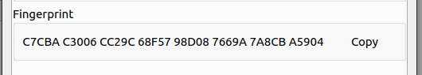

# View Key Pair Details

Right-click the key pair in the key toolbox or key management interface and click Show key details to view the
information about the key pair.

This part may involve a brief introduction to gpg-related concepts, and it will be relatively long.

The screenshot below is my friend's public key that I got from the key server.

Below is a private key I randomly generated. You can find that the biggest difference between him and the above is that
the key pair with only the public key is only used for encryption, and if you have the private key, you can do more
things (it also depends on your algorithm, DSA can only for signature).

## General Info

This interface provides some useful information to assist you in proper management of the key pair.

### Owner

Through this section, you can understand the owner of this key pair. This information is not fixed and unchangeable. You
can create a new UID in the UID section and set it as the main UID to change it.

According to the OpenPGP protocol, this part is divided into Name, Email, and Comment.

### Primary key

This part is the information of the primary key of the key pair. The primary key is very important, because without it,
the key pair cannot perform related management operations such as adding and revoking sub-keys (similar to the key ring
cannot be opened). Let's introduce the information of the primary key separately below. If you want to learn more, see
the [Basic Concepts](../basic-concepts.md) section.

The absence of the master key means that the private key of the master key does not exist, but neither the public key
nor the private key exists. Please remember: Each subkey and primary key consists of a pair of public and private keys.

#### Key ID

The unique identifier of the key is fixed and unchanging. Note that this key ID is the key ID of the primary key. The
key ID is uniquely determined after the key is generated. Compared with the fingerprint, the key ID will be shorter and
more user-friendly.

#### Algorithm

Algorithm used for key generation. Note that this also refers to the generation algorithm of the primary key. The
generation algorithm determines the properties and capabilities of the key. Algorithms such as RSA can be used for
encryption and signature, but DSA can only be used for signature, but the DSA key length can be shorter.

#### Key Size

The length of the primary key. It can be said that the longer the key, the harder it is to crack the ciphertext, but at
the same time, the more time it takes for a single operation. Generally speaking, a length of 2048 bits is safe enough (
This refers to the key generated using the RSA algorithm).

#### Normal Usage

What can the key pair conceptually be used for (including the conceptual usage of the primary key and sub-key). When the
primary key or subkey generation can be used to sign, but it has already expired or does not exist, the signature usage
will still be displayed here.

#### Actual Usage

The actual usage of the primary key and all subkeys. It is the union of their usage. If there is only one primary key in
the key pair that can be used for signing, but this primary key does not exist. Then the signature usage will not appear
here, only in Normal Usage. In addition, when there is only one subkey that can be used for signing, if it has expired,
the signature purpose will not be displayed here.

#### Expires on

The expiration time of the primary key. When the primary key expires, it will be invalid. You cannot use it for any
operation. In addition, the subkeys in the key pair will also be unavailable. Fortunately, you can change the expiration
time of the primary key at any time, or even set it to never expire. The prerequisite for this is that the primary key
exists in the key pair.

#### Last Update

The time when the content of the key pair was last updated. Operations such as adding a UID or subkey will modify the
content of the key pair.

#### Secret Key Existence

Shows whether the actual content of the primary key exists. When the primary key does not exist, if there are still
available subkeys in the key pair, the key pair can still be used for normal operations. However, in the above case, the
content of the key pair cannot be modified (that is, operations such as adding UID or subkey cannot be performed), and
the key pair cannot sign other key pairs.

### Fingerprint

The fingerprint of the key pair is used for humans to quickly compare whether the key pair is the expected key pair.
This field is unique for all keys in the world. You can absolutely do this with the key ID mentioned above.

This also refers to the fingerprint of the primary key.

## UID Info

UID is used to identify the key, and this mechanism is mainly used to facilitate human identification. You can compare
the UID to the accompanying name tag on a key ring, indicating who the key ring belongs to. Humans can roughly identify
whether a key pair is what he expected by looking at the UID, but to accurately identify it, fingerprints or key id need
to be compared. A key can have one or more UIDs. A key pair has one and only one primary UID.

The primary UID on the interface is always the first in the list.

UID has three elements, Name, Email, Comment. The name must be greater than or equal to five characters, and the email
must conform to the format. Comment rules are relatively loose.

### Signature of UID

The bottom half of the interface is the signature of the UID you checked in the list of UIDs (not checked in the box).

This is a key trust system. The person who gets your public key actually gets a copy of your key ring, but only the
public key and your nameplate are on the key ring. He can sign your brand with his private key, which means he
recognizes your brand and the public key on the entire key ring. He can then upload the keyring with his signature to
the keyserver, and if a lot of people do this one after another, the public key on the keyserver will have a bunch of
signatures. If there are a lot of signatures on the nameplate, it means that many people recognize the public key and
endorse it, so that the public key can be trusted by everyone.

You can use the primary key of another key pair to sign a UID. In repeating, in general. When the primary UID of a key
pair has many valid signatures attached, it will be more trustworthy than without a valid key pair.

## Subkey Info

The sub-key mechanism is an important content of gpg, which enhances flexibility and security, but also brings a certain
degree of complexity, making it difficult for beginners to understand.If you have absolutely no idea about this, you can
refer to the [Basic Concepts](../basic-concepts.md) section first.

In order to help you understand this concept and get a preliminary grasp, you only need to read the following points:

- A key pair can be compared to a key ring, with a primary key(a pair of public and private keys) and multiple subkeys (
  or no subkeys).
- Each subkey and primary key consists of a pair of public and private keys.
- The sub-key can do relate operations (such as signing, encryption) when the primary key is not present or cannot.
- The functions of the sub-keys can overlap. When both sub-keys can be used for signing, the earliest generated one is
  selected for this operation.
- The sub-key can use more algorithms than the primary key, but generally they have the same effect on daily operations.
- The disclosure of the subkey only affects the subkey, and the entire key pair is in danger after the disclosure of the
  primary key.

The primary key and all subkeys in the key pair are listed on the interface. The first key in the list must be the main
key, regardless of whether it actually exists or not. Some information about the key is listed below. In fact, you can
know by observation that the information of the primary key here is exactly the same as the information of the first
tab.

### Key In smart card

Whether it is in the smart card refers to whether the key is moved to the smart card. Moving the key to the smart card
will change the structure of the key and is irreversible.

### Operations

In this column, what you can do is different for a key pair that has only a public key or a key pair that includes a
private key.

Here's what you can do with a public key-only key pair.

And the screenshot below lists what a key pair containing a private key can do.

These operations will be scattered in the documentation to explain in detail.

