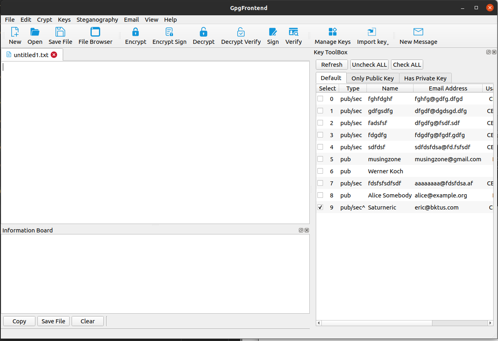

# Overview of GpgFrontend

---

**GpgFrontend** is a Powerful, Easy-to-Use, Compact, Cross-Platform, and
Installation-Free [OpenPGP](https://www.openpgp.org/) Crypto Tool.

By using GpgFrontend, you can quickly encrypt and decrypt text or files. Or at
the same time as the above operations, you can add your own signature to let
others know that this document or this paragraph of text was issued by you.

Furthermore, it visualizes most of the common operations of gpg commands. It
aims to allow ordinary users to quickly use gpg and make professional users more
convenient. GpgFrontend supports new features of GnuPG 2.x.

**The corresponding release version for this
Document: [v2.0.4](https://github.com/saturneric/GpgFrontend/releases/tag/v2.0.4)**

## Interface

Note: For different operating system and system style settings, GpgFrontend may
look different.Documentation can also vary widely from release to release.
Please check the corresponding program release version for the document.

## System Requirement

Before proceeding with the installation and usage of GpgFrontend, it's crucial
to understand the system requirements that ensure optimal performance. This
section provides comprehensive details about the necessary software
dependencies, hardware specifications, and the compatible operating systems.
Meeting these requirements will ensure a smooth, efficient experience while
using GpgFrontend.

Please read the following subsections carefully to confirm that your system
aligns with the recommended configurations.

### Operating System

GpgFrontend is compatible with major operating systems including Linux, macOS,
and Windows. Specifically, it requires Windows 10 and later, macOS 10.15 High
Sierra and later, and Ubuntu 18.04 LTS or other equivalent Linux distributions.

### Software Dependencies

Qt5 or Later: GpgFrontend is developed using the Qt framework. Therefore, a
runtime of Qt5 or later is required for the software to function correctly.
Please note, the Qt5 runtime is integrated into the Release Package for Linux,
macOS, and Windows, so it generally does not need to be considered separately.
This allows for easier setup and ensures compatibility across different systems.

GnuPG: As the frontend for GnuPG, GpgFrontend requires GnuPG (version 2.2.0 or
higher) to be pre-installed in your system. Please note, GpgFrontend is not
compatible with GnuPG 1.x versions. Users employing earlier versions of GnuPG 2
may encounter some unforeseen issues. We strongly recommend updating to the
supported versions to ensure a seamless experience.

### Hardware

While the specific hardware requirements largely depend on the size and
complexity of the data you're working with, we generally recommend:

A computer with at least 1 GB of RAM. However, 2 GB or more is preferable for
smoother performance. The majority of these resources are allocated to your
operating system, but around 100 MB of memory is needed to ensure the smooth
running of GpgFrontend. At least 200 MB of free disk space for software
installation. Additional space will be needed for ongoing work.

Please note, these requirements are intended to be guidelines rather than strict
rules. It's possible that GpgFrontend will work on lower-spec hardware, but for
optimal performance, the above specifications are recommended.

### Network

Although not necessary for basic operation, an active Internet connection may be
required for software updates and accessing online help resources.

Please note that these are the minimal requirements that we tested, and actual
requirements for your use case could be higher, especially for large datasets.

## Origin

The GpgFrontend project inherit from a relatively mature but not maintained
[gpg4usb](https://www.gpg4usb.org/) project. It inherits the stable,
easy-to-use, compact, and installation-free features of gpg4usb, and plans to
support some new features of OpenPGP based on it and continue to improve it.

## Purpose

The aim of GpgFrontend is to enable people worldwide, even those without command
line or programming experience, to safely transmit information to their desired
destination. Although free software is a common asset for all humankind, there
are still many individuals who are unable to benefit from it due to their
limited knowledge and usage habits. We need to break this cycle. GpgFrontend is
dedicated to enhancing the ease-of-use and intuitiveness of the free software
GnuPG, with the ultimate goal of making it accessible to a broader audience.

The GpgFrontend project is as open source, and it also insists on using open
source codes and libraries.

### Free forever

GpgFrontend will be free forever, and you don't need to worry about being asked
to pay a fee to use the software one day.

## Source Code

The original code repository of Gpg Frontend is hosted on the server of Codes
Dream, and each submission will be submitted to the code repository first. You
can click
[Here](https://git.codesdream.com/?p=public/main/GpgFrontend.git;a=summary) to
visit the original code repository and track development progress.

注意：中国用户请访问[这里](https://git.codesdream.com/main/GpgFrontend.git)

### License

The source code for GpgFrontend is licensed under the GPL-3.0 license, which
ensures that GpgFrontend is open-source software. You have the right to exercise
the rights specified in the license, subject to compliance with the terms of the
license.

### Contribution

Furthermore, the addition of new features does not compromise the existing core
functionality. As an individual, my capabilities are limited. Therefore,
GpgFrontend welcomes volunteers to contribute to the project. You can file
issues or submit pull requests through the GitHub platform. Additionally, you
can submit your questions and code contributions via email. Please feel free to
send problem reports and patches to me.

## Privacy Guarantee

GpgFrontend operates without servers, and does not require servers to be
operational. While it utilizes the OpenPGP protocol for public key transfers, it
does not collect or upload any additional information.

For users with elevated security requirements, a version of GpgFrontend will be
available in the future which will not have internet access capability.
