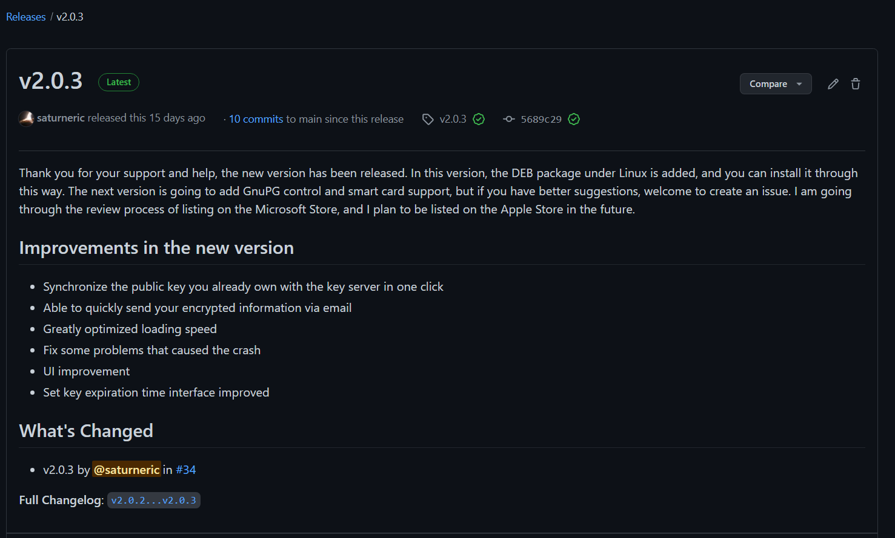
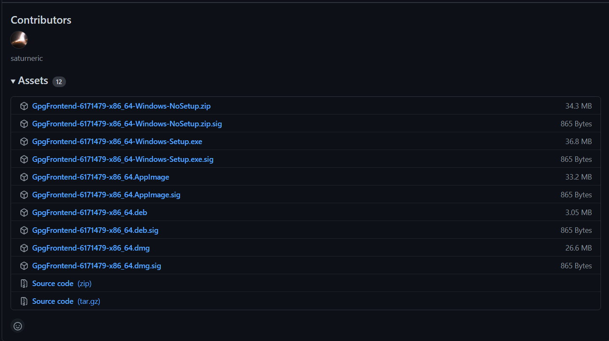

# Quick Start

Getting started with GpgFrontend is very simple, you only need a few very simple steps. Moreover, it is oriented to all PC platforms.

## Get channels

The current mainstream distribution channel is the Release feature available through GitHub. It's free and accessible to most people in the world, without me having to worry about servers and bandwidth, which allows me to save a lot of money.

When you click on the [download](https://github.com/saturneric/GpgFrontend/releases/latest), you can see such an interface. It identifies the current version number of the latest release, the release date of that version, and so on.



You can see some notable features or fixes for the version in the main text, or if you're a programmer, you can also click change log to get how the source code differs from the previous version. It is worth mentioning that you can see two green tick marks, which represent that I have personally signed up to the source code of the version. This may be important for some people with high security needs.

Then, if you swipe down, you can see a lot of Assets, which are releases for GpgFrontned for different operating systems. As you can see, the parts of the file name are separated by separators. You need to know that the second section(e.g. 6171479) provides a unique identification number for the version's source code, and when pointing out problems with a version, you need to provide the 7-digit unique identification number of the released version you are using. 



Files with sig as the suffix are gpg separate signatures for the released version of the file of the same name. You can use gpg to check if the changed file is signed and approved by me. 

Follow your needs or follow the instructions below to click on the name of the corresponding release version to download.

## Install & Run

GpgFrontend is cross-platform, which is one of its differences. For your operating system, you'll need to choose different ways to lay out GpgFrontend. It is worth noting that GpgFrontend only supports 64-bit operating systems. Please check your hardware with your operating system.

### Pre-conditions

GpgFrontend runs dependent on the basic features provided by GnuPG, so you need to install GnuPG before you can install GpgFrontend. Why does GpgFronend require users to install GnuPG separately?Starting with GnuPG 2.0, gpg relies on separate modules to do all of its functions. This requires that when using gpg, these modules all need to be in the correct location on your operating system so that the gpg can find them.

GnuPG is not included by default in some operating systems (e.g. Windows and macOS), so this situation has caused GpgFrontend to be temporarily unavailable in the Apple Store and Microsoft Store. I have plans to launch GnuPG-based version 1.4 in the future, which will enable GpgFrontend users to start using it when they get it.

In general, the latest Linux distributions offer a GnuPG 2.0 environment. You can check by typing `gpg --version` in the command line tool. **In general, it is recommended to install versions of GnuPG 2.1 and above.**

### Windows (No Setup)

0. If you haven't installed gnupg,
   please [Download](https://gnupg.org/ftp/gcrypt/binary/gnupg-w32-2.3.1_20210420.exe) `gnupg-w32-******.exe` and
   install it.
1. [Download](https://github.com/saturneric/GpgFrontend/releases/latest)`GpgFrontend-*******-Windows-NoSetup.zip`
2. Unzip `GpgFrontend-*******-Windows-NoSetup.zip`
3. Go into the directory and double click `GpgFrontend.exe`.

### Windows（Setup）

1. [Download](https://github.com/saturneric/GpgFrontend/releases/latest) `GpgFrontend-*******-Windows-Setup.exe`
2. Install it and you can find GpgFrontend on your desktop.

### macOS

1. [Download](https://github.com/saturneric/GpgFrontend/releases) `GpgFrontend-*******-x86_64.dmg`
2. Double-Click GpgFrontend.dmg to load it
   - macOS will automatically decompress the zip file and then you will be able to see the dmg
3. Double click and run it. All published app packages have passed Apple's check, which means you can open it directly.
4. If it satisfies you, you can drag it into your Application folder.

#### Debian/Ubuntu/CentOS (AppImage)

AppImage is a format used in Linux systems to distribute portable software without the need for superuser privileges to install them. The core idea of AppImage is a file as an application. Each AppImage contains the application and all the files needed for the application to run. In other words, in addition to the underlying components of the operating system itself, AppImage runs without dependency. This is convenient for users.

0. Install gnupg (If you have already followed please skip)
    - For Debian/Ubuntu
       ```shell
       $ sudo apt update
       $ sudo apt install gpg
       ```
    - For CentOS
       ```shell
       $ sudo yum install gnupg 
       ```
1. [Download](https://github.com/saturneric/GpgFrontend/releases) `GpgFrontend-*******-x86_64.AppImage`
2. Give `GpgFrontend-***.AppImage` permission to execute
    ```shell
    $ chmod u+x ./GpgFrontend-***-x86_64.AppImage
    ```
3. Just double-click `GpgFrontend-***-x86_64.AppImage` to run it.

### Debian/Ubuntu (DEB)

With deb, you can easily manage dependencies using the apt tool. Deb packages are small compared to AppImage. 

0. Install gnupg (If you have already followed please skip)

   - For Debian/Ubuntu

     ```shell
     $ sudo apt update
     $ sudo apt install gpg
     ```

1. [Download](https://github.com/saturneric/GpgFrontend/releases) `GpgFrontend-*******-x86_64.deb`

2. Use apt to install GpgFrontned.

   ```shell
   $ apt install ./GpgFrontend-*******-x86_64.deb
   ```

3. At this point, you can find the GpgFrontend icon in your app menu.